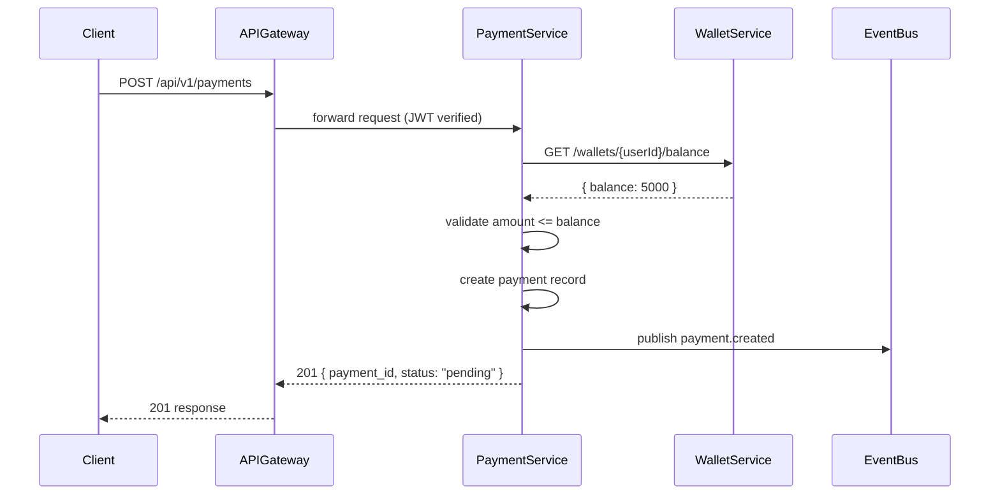

# Feature Overview: {Feature Name} — {Service Name}

> **Service**: payment-service  
> **Repository**: gitlab.company.com/backend/payment-service  
> **Branch**: req-000001  
> **Change Type**: API Addition

---

## API Specification

### Endpoints

| Method | Path | Summary | Auth |
|--------|------|---------|------|
| POST | /api/v1/payments | Create a new payment | Bearer JWT |
| GET | /api/v1/payments/{id} | Get payment by ID | Bearer JWT |

---

### POST /api/v1/payments

**Description**: Creates a new payment transaction.

**Request**

```json
{
  "amount": 1000,
  "currency": "THB",
  "source_wallet_id": "wallet_abc123",
  "destination": {
    "type": "bank_account",
    "account_number": "1234567890",
    "bank_code": "SCB"
  },
  "reference": "order_xyz789",
  "metadata": {}
}
```

**Response 201 Created**

```json
{
  "payment_id": "pay_def456",
  "status": "pending",
  "amount": 1000,
  "currency": "THB",
  "created_at": "2026-05-29T10:00:00Z"
}
```

**Error Codes**

| Code | Status | Description |
|------|--------|-------------|
| INSUFFICIENT_FUNDS | 422 | Wallet balance too low |
| INVALID_BANK | 400 | Unknown bank code |
| DUPLICATE_REFERENCE | 409 | Reference already used |

---

## Dependencies

### Internal Services

| Service | Call | Purpose |
|---------|------|---------|
| wallet-service | GET /wallets/{userId}/balance | Validate sufficient funds |
| user-service | GET /users/{userId} | Verify user is active |

### External Repositories

| Repository | Version/Branch | Purpose |
|-----------|---------------|---------|
| payment-gateway-sdk | v2.3.0 | Bank transfer integration |
| event-bus-client | main | Publish payment events |

### Message Queues / Events

| Event | Type | Schema |
|-------|------|--------|
| payment.created | Producer | `{ payment_id, amount, user_id, timestamp }` |
| payment.failed | Producer | `{ payment_id, reason, timestamp }` |

---

## Database Changes

### New Tables

```sql
CREATE TABLE payments (
    id          UUID PRIMARY KEY DEFAULT gen_random_uuid(),
    user_id     UUID NOT NULL REFERENCES users(id),
    amount      BIGINT NOT NULL,
    currency    VARCHAR(3) NOT NULL,
    status      VARCHAR(20) NOT NULL DEFAULT 'pending',
    reference   VARCHAR(255) UNIQUE,
    created_at  TIMESTAMPTZ NOT NULL DEFAULT NOW(),
    updated_at  TIMESTAMPTZ NOT NULL DEFAULT NOW()
);
```

### Modified Tables

```sql
ALTER TABLE orders ADD COLUMN payment_id UUID REFERENCES payments(id);
```

---

## Sequence Diagram



---

## Acceptance Criteria

- [ ] POST /api/v1/payments returns 201 with `payment_id` and `status: "pending"`
- [ ] Payment fails with 422 INSUFFICIENT_FUNDS when wallet balance is too low
- [ ] `payment.created` event is published to the event bus upon successful creation
- [ ] `payment.failed` event is published when the payment fails
- [ ] Duplicate `reference` returns 409 DUPLICATE_REFERENCE
- [ ] GET /api/v1/payments/{id} returns 404 for non-existent payment
- [ ] All endpoints require valid Bearer JWT (401 without token)

---

## Non-functional Requirements

- POST /payments p99 latency < 500ms (excluding bank network calls)
- Payment records must be durable (database write before event publish)

---

## References

- Figma: {link}
- RFC: {link}
- Related issues: {links}
